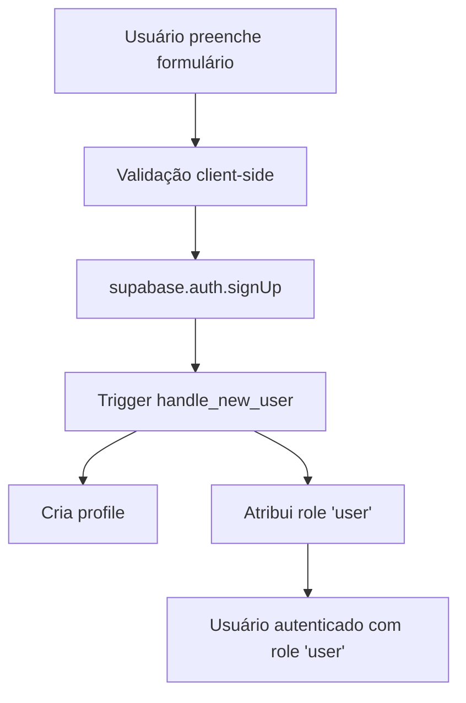
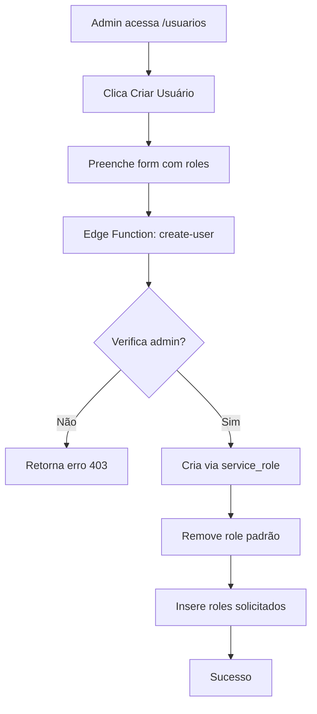
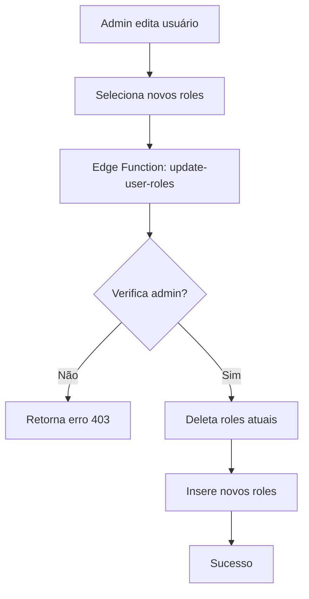

# Sistema de Roles e Segurança

## Visão Geral

O sistema implementa um modelo seguro de gestão de papéis (roles) com validação server-side para prevenir privilege escalation e garantir que apenas administradores possam criar ou modificar roles especiais.

## Arquitetura de Segurança

### Roles Disponíveis

1. **user** (Usuário comum)
   - Role padrão para todos os novos cadastros públicos
   - Acesso básico ao sistema
   
2. **collaborator** (Colaborador)
   - Acesso a funcionalidades de colaboração
   - Pode gerenciar contatos de discipulado atribuídos
   
3. **social_media** (Mídia Social)
   - Pode criar e gerenciar posts
   - Pode gerenciar testemunhos
   - Pode visualizar mensagens de contato
   
4. **admin** (Administrador)
   - Acesso total ao sistema
   - Único role que pode criar/modificar outros roles
   - Pode gerenciar usuários

### Princípios de Segurança

#### 1. Signup Público = Sempre "user"

- **Formulário público** (`/login`): Sempre cria usuários com role "user"
- **Trigger automático**: `handle_new_user()` garante que todo novo usuário recebe role "user"
- **Sem manipulação client-side**: Impossível criar conta com outro role via signup público

#### 2. Gestão de Roles = Apenas Admin

- **Validação server-side**: Todas as operações de role são validadas via Edge Functions
- **Token verification**: Edge Functions verificam o token do usuário e validam role "admin"
- **Service Role Key**: Operações privilegiadas usam service_role key (nunca exposta ao cliente)

#### 3. Proteção Contra Privilege Escalation

- **Não há endpoints públicos** para modificar roles
- **Client-side não pode elevar privilégios**: Todo CRUD de roles passa por Edge Functions com verificação de admin
- **Admin não pode se auto-deletar**: Proteção contra lockout acidental

## Edge Functions de Segurança

### 1. `create-user`

**Propósito**: Criar novos usuários com roles específicos (apenas admin)

**Fluxo**:
1. Verifica autenticação do requisitante
2. Valida que requisitante tem role "admin"
3. Valida entrada (email, senha, nome, roles)
4. Cria usuário via service_role
5. Remove role "user" padrão (criado pelo trigger)
6. Insere roles solicitados

**Segurança**:
- ✅ Requer autenticação
- ✅ Requer role "admin"
- ✅ Valida roles permitidos
- ✅ Rollback automático em caso de erro

### 2. `update-user-roles`

**Propósito**: Atualizar roles de usuários existentes (apenas admin)

**Fluxo**:
1. Verifica autenticação do requisitante
2. Valida que requisitante tem role "admin"
3. Remove roles existentes do usuário alvo
4. Insere novos roles

**Segurança**:
- ✅ Requer autenticação
- ✅ Requer role "admin"
- ✅ Valida roles permitidos
- ✅ Garante que pelo menos "user" é atribuído se nenhum role válido for fornecido

### 3. `delete-user`

**Propósito**: Excluir usuários (apenas admin)

**Fluxo**:
1. Verifica autenticação do requisitante
2. Valida que requisitante tem role "admin"
3. Impede que admin delete a si mesmo
4. Deleta usuário (cascade remove roles e profile)

**Segurança**:
- ✅ Requer autenticação
- ✅ Requer role "admin"
- ✅ Proteção anti-lockout (admin não pode se deletar)
- ✅ Cascade deleta dados relacionados

### 4. `list-users`

**Propósito**: Listar todos os usuários com emails e roles (apenas admin)

**Fluxo**:
1. Verifica autenticação do requisitante
2. Valida que requisitante tem role "admin"
3. Busca profiles, roles e emails via service_role
4. Retorna dados combinados

**Segurança**:
- ✅ Requer autenticação
- ✅ Requer role "admin"
- ✅ Protege emails de exposição não autorizada

## RLS Policies

### Tabela `user_roles`

```sql
-- Apenas admins podem visualizar roles
CREATE POLICY "User roles viewable by admins"
ON public.user_roles FOR SELECT
USING (has_role(auth.uid(), 'admin'::app_role));

-- Apenas admins podem gerenciar roles
CREATE POLICY "Admins can manage user roles"
ON public.user_roles FOR ALL
USING (has_role(auth.uid(), 'admin'::app_role));
```

### Função de Verificação Segura

```sql
CREATE OR REPLACE FUNCTION public.has_role(_user_id uuid, _role app_role)
RETURNS boolean
LANGUAGE sql
STABLE SECURITY DEFINER
SET search_path = public
AS $$
  SELECT EXISTS (
    SELECT 1
    FROM public.user_roles
    WHERE user_id = _user_id AND role = _role
  )
$$;
```

**Por que SECURITY DEFINER?**
- Executa com privilégios do owner da função
- Bypassa RLS temporariamente para verificação
- Previne recursão infinita em policies

## Fluxo de Usuário

### Novo Usuário (Signup Público)



### Admin Cria Usuário com Role Especial



### Admin Modifica Roles



## Validações Implementadas

### Client-Side (UX)

- ✅ Validação de email único
- ✅ Senha com requisitos mínimos (8 chars, maiúscula, minúscula, número, especial)
- ✅ Confirmação de senha
- ✅ Feedback visual de erros

### Server-Side (Segurança)

- ✅ Autenticação obrigatória para operações privilegiadas
- ✅ Verificação de role "admin" em todas as operações de gestão
- ✅ Validação de roles permitidos
- ✅ Proteção contra auto-exclusão de admin
- ✅ Rollback automático em caso de erro parcial

## Prevenção de Ataques

### Privilege Escalation

**Vetor de Ataque**: Usuário tenta se auto-promover a admin

**Mitigação**:
- RLS policies impedem acesso direto à tabela `user_roles`
- Edge Functions validam role do requisitante
- Service role key nunca exposta ao cliente

### Token Manipulation

**Vetor de Ataque**: Usuário tenta manipular JWT para falsificar role

**Mitigação**:
- JWT assinado por Supabase (verificação automática)
- Edge Functions fazem lookup em banco de dados para confirmar roles
- Não confia em dados do token para autorização

### Direct API Access

**Vetor de Ataque**: Usuário tenta acessar diretamente API Supabase

**Mitigação**:
- RLS policies bloqueiam queries não autorizadas
- Anon key tem permissões limitadas
- Service role key usada apenas server-side

### SQL Injection

**Vetor de Ataque**: Usuário tenta injetar SQL via inputs

**Mitigação**:
- Supabase Client usa queries parametrizadas
- Validação de entrada via Zod schemas
- RLS adiciona camada extra de proteção

## Teste de Segurança

### Cenários de Teste

1. **Signup público sempre cria "user"**
   - ✅ Criar conta via `/login` → verificar role = "user"
   - ✅ Tentar manipular requisição → role permanece "user"

2. **Apenas admin cria roles especiais**
   - ✅ Login como admin → criar usuário com role "admin" → sucesso
   - ✅ Login como user → tentar criar admin → erro 403
   - ✅ Sem login → tentar criar usuário → erro 401

3. **Apenas admin modifica roles**
   - ✅ Admin altera role de "user" para "social_media" → sucesso
   - ✅ User tenta alterar próprio role → erro 403

4. **Admin não pode se deletar**
   - ✅ Admin tenta deletar própria conta → erro 400

5. **RLS protege dados**
   - ✅ User tenta query em `user_roles` → nenhum resultado (ou erro)
   - ✅ Admin query em `user_roles` → todos os roles visíveis

## Auditoria

### Registros Automáticos

- **Auth Logs**: Supabase registra todos os eventos de auth
  - Signups
  - Logins
  - Logout
  - Token refresh

- **Database Logs**: PostgreSQL registra operações
  - Inserções em `user_roles`
  - Updates em `profiles`
  - Deletes de usuários

### Onde Visualizar

- **Lovable Cloud Backend**: `<lov-open-backend>`
- **Analytics Tab**: Eventos de auth
- **Logs Tab**: Database operations

## Boas Práticas

1. **Nunca confie no cliente**: Toda validação crítica é server-side
2. **Princípio do menor privilégio**: Cada role tem apenas as permissões necessárias
3. **Defense in depth**: Múltiplas camadas (RLS, Edge Functions, validação)
4. **Auditoria contínua**: Revisar logs regularmente
5. **Teste de penetração**: Simular ataques para validar defesas

## Troubleshooting

### Erro: "Não autorizado" ao criar usuário

**Causa**: Usuário não tem role "admin"

**Solução**: Garantir que o usuário tem role "admin" no banco de dados

### Erro: "Este e-mail já está cadastrado"

**Causa**: Email já existe no sistema

**Solução**: Usar outro email ou recuperar senha do existente

### Erro: "Você não pode excluir sua própria conta"

**Causa**: Admin tentando se auto-deletar

**Solução**: Outro admin deve deletar a conta, ou criar novo admin primeiro

### Signup não funcionando

**Causa**: Configurações de auth incorretas

**Solução**: Verificar:
- Auto-confirm email habilitado (desenvolvimento)
- Site URL configurada corretamente
- Redirect URLs incluem preview URL

## Manutenção

### Adicionar Novo Role

1. Adicionar ao enum `app_role`:
```sql
ALTER TYPE app_role ADD VALUE 'new_role';
```

2. Criar RLS policies para o novo role

3. Atualizar Edge Functions para incluir no array `validRoles`

4. Atualizar UI para mostrar novo role

### Remover Role Existente

⚠️ **Cuidado**: Remover role pode quebrar policies existentes

1. Migrar usuários do role a ser removido
2. Remover policies que referenciam o role
3. Remover do array `validRoles` nas Edge Functions
4. (Opcional) Remover do enum (requer recriação da coluna)

## Conclusão

Este sistema implementa defesa em profundidade contra privilege escalation e garante que:

1. ✅ Signup público sempre cria usuários comuns
2. ✅ Apenas admins podem criar/modificar roles especiais
3. ✅ Validação server-side previne manipulação client-side
4. ✅ RLS protege dados sensíveis
5. ✅ Auditoria registra todas as operações críticas

**Princípio fundamental**: Nunca confie no cliente. Sempre valide server-side.
